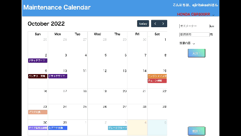

# MaintenanceCalender

# 背景
自分が使いたくなるアプリを作ろうと考えました。  
普段よくバイクを整備するので、記録して残せるアプリを作ってみました。  

# アプリの概要
- 車両の整備内容を記録してカレンダーに表示できます。
- 車両は複数台登録して切り替えることができます。
- 月ごとの走行距離と整備費用をグラフ化して表示できます。

# チャレンジ
- 外部のライブラリを使用（カレンダー、グラフ）  
使い方さえ知らなかったものをドキュメントを読み込んで使えるようになりました

- ES6のクラスを使用  
基本的にクラスで全ての処理を実行するようにしてみました。

- CSSを使ったアニメーション

# 使用した技術
- [FullCalendar](https://fullcalendar.io/)  
カレンダー表示ライブラリー

- [Popper](https://popper.js.org/)  
カレンダー上の吹き出し表示に使用

- [Tippy](https://atomiks.github.io/tippyjs/)  
カレンダー上の吹き出し表示に使用  

- [Chart.js](https://www.chartjs.org/docs/latest/)  
グラフ表示ライブラリー

# 所感
何もないまっさらな状態から作り始めるにあたって、ペアの間で最初のイメージすり合わせが一番難しかったと感じています。作って実際に動かしながらお互いにイメージを合わせました。  
やりたいこと、欲しい機能は多く挙げられるが、最低限の状態を決め仕上げていきました。自分が使いたくなる物ができたと思っていますが、更に成長させていきたいと思います。
